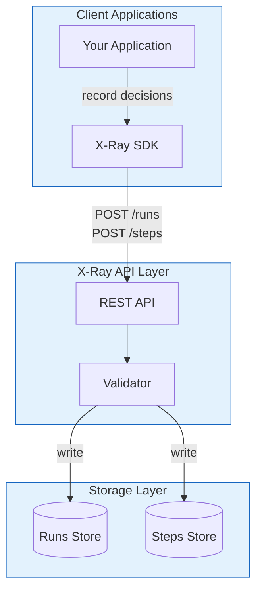

# X-Ray Debugging System Architecture

> **Version:** 1.0.0 | **Last Updated:** 2026-01-05

## System Overview

X-Ray captures multi-step decision processes so you can answer: "Why did my system recommend a phone case for someone searching for laptop stands?"



---

## 1. Data Model Rationale

### Why This Structure?

I chose a **normalized reference model** (runs and steps as separate documents) for three specific reasons:

**1. Streaming Writes**

Pipeline steps complete at different times. Embedding steps inside runs would require read-modify-write for every step, creating contention. Separate documents let you write each step independently.

```
Run created at T=0
Step 1 written at T=100ms
Step 2 written at T=500ms   ← No read-modify-write needed
Step 3 written at T=1200ms
Run completed at T=1500ms
```

**2. Document Size Limits**

A single step with 5000 candidates can be 2MB+. MongoDB has 16MB document limits. PostgreSQL JSONB performs poorly above 1MB. Separate step documents avoid this entirely.

**3. Query Isolation**

Most queries want run-level info (status, duration, final result). Loading 10 steps with thousands of candidates just to check if a run failed is wasteful.

### Alternatives I Considered

#### Option A: Fully Embedded (Steps inside Run)

```json
{
  "run_id": "run_123",
  "steps": [
    {"name": "Step 1", "candidates": [...5000 items...]},
    {"name": "Step 2", "candidates": [...3000 items...]}
  ]
}
```

| Pros | Cons |
|------|------|
| Single query gets everything | Document grows unbounded |
| Atomic updates | Every step write requires full doc read |
| Simpler mental model | Hits document size limits fast |

**Rejected because:** A 5-step pipeline with 5000 candidates per step would be 10MB+. Writes would serialize on the run document.

#### Option B: Event Sourced

```json
{"event": "run_created", "run_id": "run_123", "timestamp": "..."}
{"event": "step_added", "run_id": "run_123", "step": {...}}
{"event": "candidate_rejected", "step_id": "step_1", "candidate_id": "prod_456", "reason": "..."}
```

| Pros | Cons |
|------|------|
| Full audit trail | Requires event replay for current state |
| Supports undo/replay | Query complexity increases significantly |
| Natural append-only | Storage grows fast with fine-grained events |

**Rejected because:** Event sourcing solves compliance and replay problems I don't have. Queries become complex (find all runs where step 3 rejected more than 50% of candidates = replay all events for all runs).

#### Option C: What I Chose (Normalized References)

```json
// Run document
{"run_id": "run_123", "step_count": 5, "status": "completed"}

// Step documents (separate)
{"step_id": "step_1", "run_id": "run_123", "candidates": {...}}
{"step_id": "step_2", "run_id": "run_123", "candidates": {...}}
```

| Pros | Cons |
|------|------|
| Steps write independently | Multiple queries for full picture |
| No size limits per step | Join logic in application |
| Fast run-level queries | Slightly more complex SDK |

**Chose because:** The query pattern (find problematic runs, then drill into steps) naturally maps to this structure.

---

## 2. Debugging Walkthrough

### The Bug: Phone Case Matched to Laptop Stand Query

A user searches for "laptop stand adjustable" and the system returns a phone case as the top result. Product team files a bug. Here's how you debug it with X-Ray.

#### Step 1: Find the Bad Run

```sql
-- Find runs where final output doesn't match expected category
SELECT run_id, name, created_at, 
       json_extract(context, '$.custom.query') as query,
       json_extract(final_output, '$.result_data.category') as result_category
FROM runs
WHERE json_extract(context, '$.custom.query') LIKE '%laptop stand%'
  AND json_extract(final_output, '$.result_data.category') != 'Laptop Accessories'
ORDER BY created_at DESC
LIMIT 10;
```

Result:
```
run_id          | query                    | result_category
----------------|--------------------------|----------------
run_a1b2c3d4    | laptop stand adjustable  | Phone Accessories  ← Found it
```

#### Step 2: Get the Full Run

```bash
curl http://localhost:8000/api/v1/runs/run_a1b2c3d4
```

You see 5 steps:
```
Step 0: Generate Keywords        → ["laptop", "stand", "adjustable", "desk"]
Step 1: Search Catalog           → 100 candidates
Step 2: Filter by Category       → 45 candidates (55 rejected)
Step 3: LLM Relevance Ranking    → 45 candidates scored
Step 4: Select Best Match        → Winner: prod_789 (Phone Holder Stand)
```

The word "stand" is in both "laptop stand" and "phone holder stand". Let's dig deeper.

#### Step 3: Examine the Ranking Step

```sql
-- Look at Step 3's candidates and scores
SELECT 
    json_extract(c.value, '$.id') as product_id,
    json_extract(c.value, '$.score') as relevance_score,
    json_extract(c.value, '$.data.title') as title,
    json_extract(c.value, '$.data.category') as category
FROM steps,
     json_each(json_extract(candidates, '$.items')) as c
WHERE run_id = 'run_a1b2c3d4' AND step_index = 3
ORDER BY CAST(json_extract(c.value, '$.score') AS REAL) DESC
LIMIT 5;
```

Result:
```
product_id | relevance_score | title                           | category
-----------|-----------------|----------------------------------|------------------
prod_789   | 0.847           | Adjustable Phone Holder Stand    | Phone Accessories
prod_456   | 0.823           | Laptop Stand Aluminum Adjustable | Laptop Accessories
prod_123   | 0.819           | Ergonomic Laptop Stand Pro       | Laptop Accessories
```

**Root cause found:** The phone holder scored 0.847 because:
- "adjustable" matched (high weight)
- "stand" matched (high weight)
- Category didn't have enough weight in scoring

#### Step 4: Check the Reasoning

```sql
SELECT 
    json_extract(reasoning, '$.algorithm') as algorithm,
    json_extract(reasoning, '$.confidence') as confidence,
    json_extract(reasoning, '$.explanation') as explanation
FROM steps
WHERE run_id = 'run_a1b2c3d4' AND step_index = 3;
```

Result:
```
algorithm            | confidence | explanation
---------------------|------------|--------------------------------------------
llm_relevance_v2     | 0.85       | Scored 45 candidates. Word overlap: 0.4 weight, 
                     |            | category match: 0.2 weight, price: 0.4 weight
```

**The fix:** Category match only has 0.2 weight. Increase to 0.4 and reduce word overlap to 0.2.

#### Step 5: Verify the Fix Works

After deploying the fix, query for the same pattern:

```sql
-- Same query, check if laptop accessories now win
SELECT run_id,
       json_extract(final_output, '$.result_data.title') as winner,
       json_extract(final_output, '$.result_data.category') as category
FROM runs
WHERE json_extract(context, '$.custom.query') LIKE '%laptop stand%'
  AND created_at > '2026-01-05'
ORDER BY created_at DESC
LIMIT 5;
```

---

## 3. Queryability

### Cross-Pipeline Query Support

The data model supports queries across pipelines through consistent field structures and indexing.

#### Key Indexes

```sql
-- Run-level queries (fast)
CREATE INDEX ix_runs_status ON runs(status);
CREATE INDEX ix_runs_created_at ON runs(created_at);
CREATE INDEX ix_runs_pipeline ON runs(pipeline);

-- Step-level queries
CREATE INDEX ix_steps_run_id ON steps(run_id);
CREATE INDEX ix_steps_type ON steps(step_type);
CREATE INDEX ix_steps_run_index ON steps(run_id, step_index);
```

#### Common Cross-Pipeline Queries

**1. Find all runs with high rejection rates:**
```sql
SELECT run_id, name, pipeline,
       json_extract(summary, '$.rejection_rate') as rejection_rate
FROM runs
WHERE json_extract(summary, '$.rejection_rate') > 0.9
ORDER BY rejection_rate DESC;
```

**2. Compare filter effectiveness across pipelines:**
```sql
SELECT 
    r.pipeline,
    json_extract(f.value, '$.name') as filter_name,
    AVG(json_extract(f.value, '$.metrics.input_count')) as avg_input,
    AVG(json_extract(f.value, '$.metrics.output_count')) as avg_output,
    AVG(1.0 - (json_extract(f.value, '$.metrics.output_count') * 1.0 / 
               json_extract(f.value, '$.metrics.input_count'))) as avg_rejection_rate
FROM runs r
JOIN steps s ON r.run_id = s.run_id
JOIN json_each(s.filters) f
WHERE r.created_at > datetime('now', '-7 days')
GROUP BY r.pipeline, json_extract(f.value, '$.name');
```

**3. Find steps where a specific candidate was rejected:**
```sql
SELECT s.run_id, s.name, s.step_index,
       json_extract(rej.value, '$.reason') as reason
FROM steps s,
     json_each(json_extract(s.candidates, '$.rejected.by_reason')) rej
WHERE json_extract(rej.value, '$.sample_ids') LIKE '%prod_789%';
```

### Conventions Developers Must Follow

For queries to work across pipelines, developers must follow these conventions:

| Field | Convention | Example |
|-------|------------|---------|
| `candidate.id` | Globally unique or namespaced | `prod_123`, `user_456` |
| `step_type` | Use standard taxonomy | `candidate_generation`, `filtering`, `ranking`, `selection` |
| `filter.type` | Descriptive, snake_case | `price_range`, `min_rating`, `category_match` |
| `context.user_id` | Consistent user identifier | Same ID across all pipelines |
| `metadata.environment` | Standard env names | `production`, `staging`, `development` |

**Breaking these conventions:**
- Non-unique candidate IDs → Can't track same item across runs
- Custom step_type values → Aggregate queries miss your data
- Missing context.user_id → Can't query "all decisions for user X"

---

## 4. Performance & Scale

### Handling 5000 Candidates

The SDK handles large candidate lists through automatic sampling:

```python
# SDK automatically samples when candidates > 1000
step.add_candidates(products)  # 5000 products

# What gets stored:
{
    "total_count": 5000,
    "sampled": true,
    "sample_size": 100,
    "items": [...100 random samples...],
    "statistics": {
        "score_stats": {
            "min": 0.12,
            "max": 0.97,
            "mean": 0.54,
            "median": 0.51,
            "stdev": 0.18
        },
        "by_source": {
            "catalog_api": 3200,
            "partner_feed": 1800
        }
    }
}
```

**Storage impact:**

| Candidate Count | Detailed Mode | Summary Mode |
|-----------------|---------------|--------------|
| 100 | 15 KB | 15 KB |
| 1,000 | 150 KB | 20 KB |
| 5,000 | 750 KB | 22 KB |
| 10,000 | 1.5 MB | 25 KB |

### Summary vs Detailed Trade-offs

| Aspect | Detailed | Summary |
|--------|----------|---------|
| **Storage** | O(n) candidates | O(1) fixed ~100 samples |
| **Query: "Was prod_X considered?"** | Direct lookup | Only if in sample |
| **Query: "What was avg score?"** | Compute on read | Pre-computed |
| **Debugging specific item** | Full data available | May need to re-run |
| **Pipeline analytics** | Expensive aggregation | Ready-to-use stats |

### Who Decides What to Capture?

The SDK applies sensible defaults, but developers can override:

```python
# Default: SDK decides based on count
step.add_candidates(products)  # Auto-samples if > 1000

# Force detailed (you need individual tracking)
step.add_candidates(products, mode="detailed")  # Store all 5000

# Force summary (you know you only need stats)
step.add_candidates(products, mode="summary")  # Always sample

# Custom sample size
step.add_candidates(products, mode="summary", sample_size=500)
```

**Guidance:**

| Scenario | Recommended Mode |
|----------|------------------|
| Debugging specific failures | `detailed` |
| Production analytics | `summary` |
| A/B test analysis | `detailed` (need to compare specific items) |
| Real-time monitoring | `summary` (minimize storage/bandwidth) |

---

## 5. Developer Experience

### Minimal vs Full Instrumentation

**Minimal (3 lines, immediate value):**

```python
xray = XRayClient(base_url="http://localhost:8000/api/v1")
with xray.run("My Pipeline") as run:
    run.add_step("Process", inputs={"query": q}, outputs={"result": r})
```

You get: Run tracking, timing, success/failure status.

**Full instrumentation (complete debugging capability):**

```python
with xray.run("Recommendation Pipeline", user_id=user_id) as run:
    
    # Step 1: Track candidates
    step1 = run.add_step("Search", step_type="candidate_generation")
    step1.add_candidates(results, source="elasticsearch")
    step1.complete(result_ids=[r.id for r in results])
    
    # Step 2: Track filtering with rejection reasons
    step2 = run.add_step("Filter", step_type="filtering")
    step2.add_candidates(results)
    for r in results:
        if r.price > max_price:
            step2.reject_candidate(r.id, reason="price_too_high", 
                                   data={"price": r.price, "max": max_price})
    step2.add_filter("price_range", input_count=100, output_count=45)
    step2.complete(result_ids=filtered_ids)
    
    # Step 3: Track ranking with reasoning
    step3 = run.add_step("Rank", step_type="ranking")
    step3.add_candidates(ranked_results)
    step3.set_reasoning(
        algorithm="xgboost_v2",
        confidence=0.87,
        factors=[
            ReasoningFactor(name="price_match", value=0.8, weight=0.3),
            ReasoningFactor(name="category_match", value=1.0, weight=0.4),
        ]
    )
    step3.complete(result_ids=[ranked_results[0].id])
```

You get: Full debugging capability, rejection analysis, A/B comparison data.

**Start minimal, add instrumentation where bugs occur.**

### What Happens If API Is Down?

The SDK is designed to never break your application:

```
1. Request fails
   ↓
2. SDK catches exception (logged, not raised)
   ↓
3. Request queued locally (in-memory + disk)
   ↓
4. Background thread retries every 5 seconds
   ↓
5. When API recovers, queue flushes automatically
```

**Configuration:**

```python
from xray_sdk.config import QueueConfig

config = XRayConfig(
    queue_config=QueueConfig(
        max_queue_size=1000,       # Max items to queue
        persist_to_disk=True,      # Survive process restart
        flush_interval_seconds=5,  # Retry frequency
        batch_size=50,             # Items per flush attempt
    )
)
```

**Guarantees:**
- Your code never blocks waiting for X-Ray
- Your code never throws exceptions from X-Ray
- Data may be lost if queue fills (logged as warning)
- Data may be delayed but will arrive in order

**What you lose during outage:**
- Real-time visibility (data arrives late)
- If queue fills, oldest items dropped

**What you keep:**
- Full application functionality
- Eventually consistent data (when API recovers)

---

## 6. Real-World Application

### E-commerce Search Debugging

In a previous role, we had a product search system that occasionally returned bizarre results. A customer searched for "men's running shoes size 10" and got women's sandals. Traditional logging showed:

```
2025-03-15 14:23:01 INFO Search query: men's running shoes size 10
2025-03-15 14:23:01 INFO Found 1247 candidates
2025-03-15 14:23:02 INFO Returned 20 results
```

Useless. We knew *what* happened but not *why*.

After implementing X-Ray-style tracing, the same bug showed:

```
Step 1: Query Expansion
  - Input: "men's running shoes size 10"
  - Output: ["running", "shoes", "athletic", "footwear", "size 10"]  
  - Note: "men's" was dropped (stopword list bug)

Step 2: Category Inference
  - Algorithm: bert_category_v1
  - Prediction: "Footwear" (confidence: 0.67)
  - Rejected: "Men's Footwear" (confidence: 0.64)
  - Note: Without "men's", gender signal was weak

Step 3: Candidate Retrieval
  - Query: category:Footwear AND (running OR shoes OR athletic)
  - Candidates: 1247 (mixed men's/women's/unisex)

Step 4: Ranking
  - Top candidate: women's sandals (score: 0.89)
  - Factors:
    - Word match "shoes": 0.95 (sandals tagged as shoes)
    - Popularity boost: 0.92 (on sale, high clicks)
    - Category match: 1.0 (Footwear = Footwear)
    - Size match: 0.0 (no size 10 in women's sandals)
  - Note: Size had 0.1 weight, popularity had 0.4 weight
```

**Root causes found in 10 minutes:**
1. "Men's" was in stopword list (remove it)
2. Size match weight too low (increase to 0.3)
3. Popularity weight too high (reduce to 0.2)

Without step-level tracing with rejection reasons and factor weights, this would have been a week of adding log statements and re-deploying.

### Key Insight

The value isn't in the happy path. The value is in the 2am debugging session where you need to answer: "Why did the system decide X instead of Y?" Every field in this data model exists because I needed it to answer that question at some point.

---

## API Endpoints Summary

| Method | Endpoint | Purpose |
|:------:|----------|---------|
| `POST` | `/api/v1/runs` | Create new run |
| `GET` | `/api/v1/runs/{id}` | Get run with all steps |
| `PATCH` | `/api/v1/runs/{id}` | Complete/fail run |
| `DELETE` | `/api/v1/runs/{id}` | Delete run and steps |
| `POST` | `/api/v1/runs/{id}/steps` | Add step to run |
| `GET` | `/api/v1/runs/{id}/steps` | Get all steps for run |
| `GET` | `/api/v1/runs/{id}/steps/{stepId}` | Get single step |
| `GET` | `/api/v1/runs/query` | Search with filters |

---

<div align="center">

**[OpenAPI Spec](./openapi.yaml)** | **[SDK Reference](./README.md#api-reference)** | **[Examples](./examples/)**

</div>
