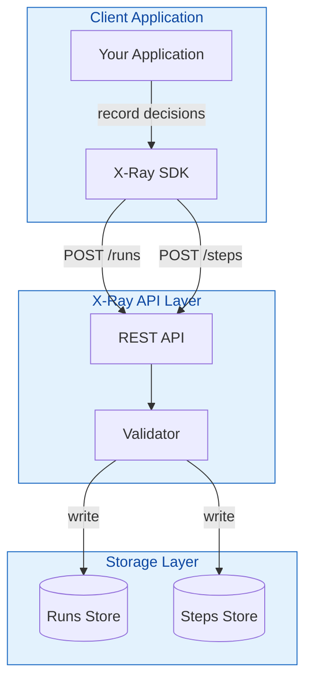
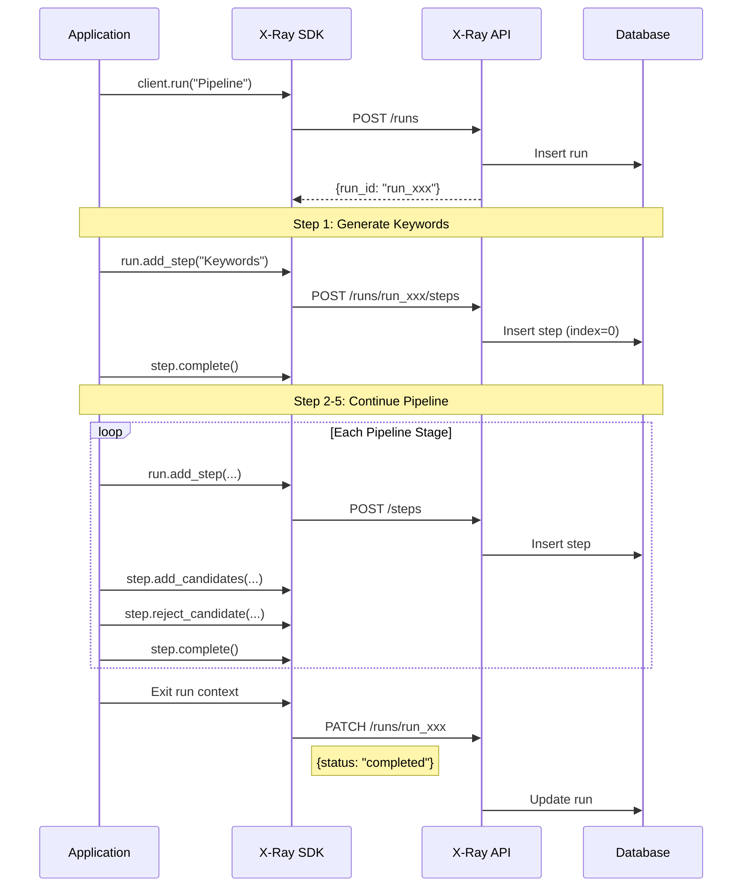
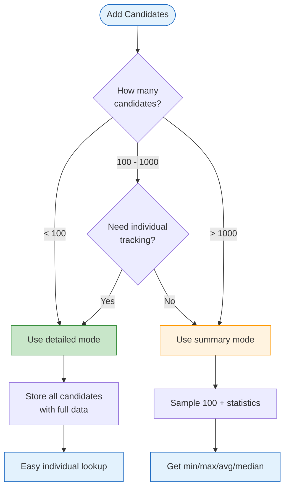
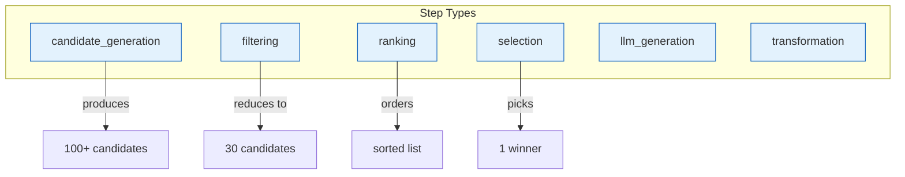
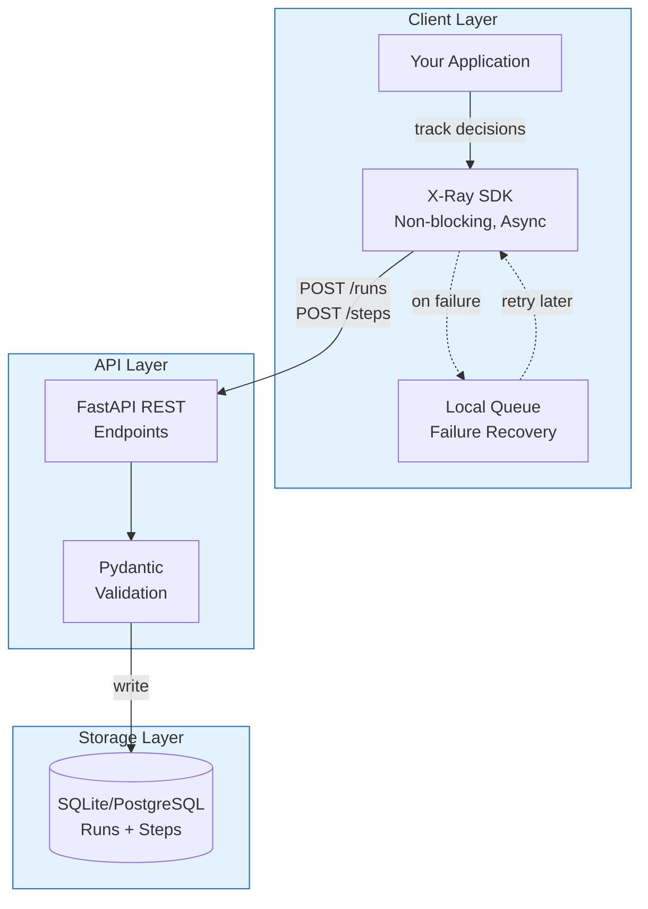
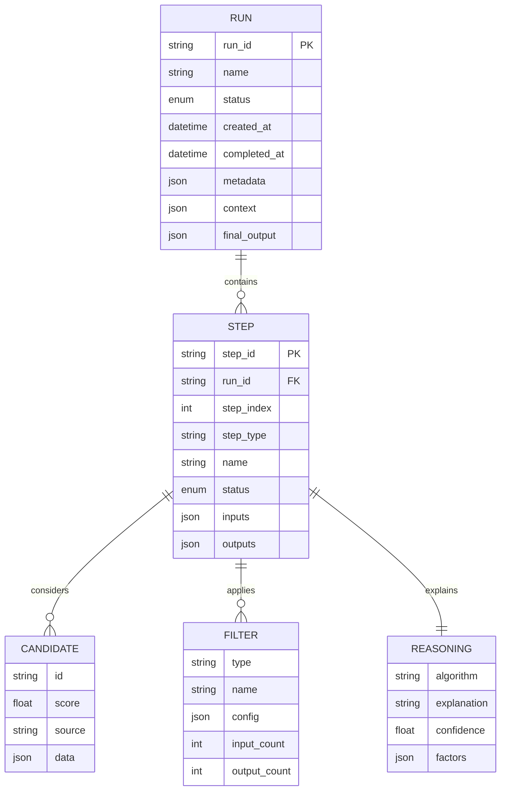

# X-Ray Debugging System

> **Version:** 1.0.0 | **Python:** 3.9+ | **License:** MIT

A powerful debugging system for tracking, analyzing, and understanding multi-step decision processes in your applications. X-Ray provides complete visibility into *what* decisions were made, *why* they were made, and *how* candidates were filtered at each stage.

---

## Table of Contents

- [Quick Start (5 minutes)](#quick-start-5-minutes)
  - [Installation](#installation)
  - [Minimal Example](#minimal-example-3-lines-of-code)
  - [Setup Instructions](#setup-instructions)
- [Full Example](#full-example)
  - [Complete Competitor Selection Walkthrough](#complete-competitor-selection-walkthrough)
- [API Reference](#api-reference)
  - [SDK Methods](#sdk-methods)
  - [Configuration Options](#configuration-options)
- [Best Practices](#best-practices)
  - [When to Use Detailed vs Summary Mode](#when-to-use-detailed-vs-summary-mode)
  - [How to Structure Step Names](#how-to-structure-step-names)
  - [Metadata Conventions](#metadata-conventions)
- [Architecture Overview](#architecture-overview)
- [Known Limitations and Future Improvements](#known-limitations-and-future-improvements)
- [Troubleshooting](#troubleshooting)

---

# Quick Start (5 minutes)

## Installation

```bash
# Clone the repository
git clone https://github.com/your-org/xray_system.git
cd xray_system

# Create virtual environment
python -m venv venv
source venv/bin/activate  # On Windows: venv\Scripts\activate

# Install dependencies
pip install fastapi uvicorn sqlalchemy requests pydantic

# Start the API server
uvicorn api.main:app --reload --port 8000
```

**Verify installation:**

```bash
curl http://localhost:8000/health
# Response: {"status": "healthy", "timestamp": "2026-01-05T..."}
```

## Minimal Example (3 Lines of Code)

```python
from xray_sdk import XRayClient

client = XRayClient(base_url="http://localhost:8000/api/v1")
with client.run("My Decision Pipeline") as run:
    run.add_step("Process Data", inputs={"query": "example"})
```

That is all you need to start tracking decisions. The SDK handles:
- Automatic run creation and completion
- Step indexing and timestamps
- Async, non-blocking API calls
- Graceful failure handling with local queueing

## Setup Instructions

### 1. Environment Variables (Optional)

Configure the SDK via environment variables for production:

```bash
export XRAY_BASE_URL="http://localhost:8000/api/v1"
export XRAY_API_KEY="your-api-key"
export XRAY_ENVIRONMENT="production"
export XRAY_DEBUG="false"
export XRAY_ASYNC_ENABLED="true"
export XRAY_MAX_RETRIES="3"
export XRAY_QUEUE_SIZE="1000"
export XRAY_PERSIST_QUEUE="true"
```

### 2. Using Configuration Object

```python
from xray_sdk import XRayClient, XRayConfig
from xray_sdk.config import RetryConfig, AsyncConfig

config = XRayConfig(
    base_url="http://localhost:8000/api/v1",
    api_key="your-api-key",
    environment="production",
    debug=False,
    retry_config=RetryConfig(max_retries=3),
    async_config=AsyncConfig(enabled=True, max_workers=4),
)

client = XRayClient(config=config)
```

### 3. Brief Explanation of Approach

X-Ray uses a **normalized reference model** where runs and steps are stored as separate documents linked by IDs. This design enables:

- **Streaming writes**: Add steps as they complete without blocking
- **No document size limits**: Handle pipelines with thousands of steps
- **Efficient queries**: Query runs without loading all step data
- **Flexible storage**: Large candidate lists can be offloaded to blob storage



---

# Full Example

## Complete Competitor Selection Walkthrough

This example demonstrates a 5-step pipeline for finding competitor products, showcasing the full power of X-Ray's tracking capabilities.

### Pipeline Overview

```mermaid
flowchart LR
    subgraph Step1["Step 1: Keywords"]
        K[Generate Keywords]
    end
    
    subgraph Step2["Step 2: Search"]
        S[Search Catalog]
    end
    
    subgraph Step3["Step 3: Filter"]
        F1[Price Filter]
        F2[Rating Filter]
    end
    
    subgraph Step4["Step 4: Rank"]
        R[LLM Relevance]
    end
    
    subgraph Step5["Step 5: Select"]
        SEL[Best Match]
    end
    
    K -->|"5 keywords"| S
    S -->|"100 products"| F1
    F1 -->|"~50 products"| F2
    F2 -->|"~30 products"| R
    R -->|"ranked list"| SEL
    SEL -->|"1 winner"| RESULT((Result))
    
    style Step1 fill:#e3f2fd,stroke:#1565c0
    style Step2 fill:#e3f2fd,stroke:#1565c0
    style Step3 fill:#e3f2fd,stroke:#1565c0
    style Step4 fill:#e3f2fd,stroke:#1565c0
    style Step5 fill:#e3f2fd,stroke:#1565c0
    style RESULT fill:#bbdefb,stroke:#1565c0
```



### Data Models

```python
from dataclasses import dataclass
from typing import List, Optional, Dict

@dataclass
class Product:
    """Represents a product in our catalog."""
    id: str
    title: str
    category: str
    price: float
    rating: float
    review_count: int
    brand: str
    features: List[str]
    relevance_score: Optional[float] = None
    
    def to_dict(self) -> Dict:
        return {
            "id": self.id,
            "title": self.title,
            "category": self.category,
            "price": self.price,
            "rating": self.rating,
            "review_count": self.review_count,
            "brand": self.brand,
            "features": self.features,
            "relevance_score": self.relevance_score,
        }

@dataclass
class InputProduct:
    """The product we want to find competitors for."""
    title: str
    category: str
    price: float
```

### Complete Pipeline Implementation

```python
from xray_sdk import XRayClient, Candidate, ReasoningFactor
from datetime import datetime

class CompetitorSelectionPipeline:
    """Multi-step pipeline for finding competitor products."""
    
    def __init__(self, base_url: str = "http://localhost:8000/api/v1"):
        self.client = XRayClient(base_url=base_url)
    
    def find_competitors(
        self, 
        product: InputProduct,
        price_tolerance: float = 0.3,
        min_rating: float = 3.5,
    ) -> Optional[Product]:
        """Find the best competitor product."""
        
        with self.client.run(
            name="Competitor Selection Pipeline",
            user_id="demo_user",
            session_id=f"session_{datetime.now().strftime('%Y%m%d_%H%M%S')}",
            tags=["competitor-selection", "demo"],
            context={
                "custom": {
                    "input_product": {
                        "title": product.title,
                        "category": product.category,
                        "price": product.price,
                    },
                    "price_tolerance": price_tolerance,
                    "min_rating": min_rating,
                }
            }
        ) as run:
            
            # ─────────────────────────────────────────────────────────────
            # STEP 1: Generate Search Keywords
            # ─────────────────────────────────────────────────────────────
            step1 = run.add_step(
                name="Generate Search Keywords",
                step_type="llm_generation",
                inputs={
                    "product_title": product.title,
                    "product_category": product.category,
                    "prompt_template": "Extract search keywords",
                }
            )
            
            # Mock LLM call - in production, call your LLM service
            keywords = ["wireless", "headphones", "noise", "cancelling"]
            
            step1.set_reasoning(
                algorithm="keyword_extraction",
                explanation=f"Extracted {len(keywords)} keywords from product info",
                confidence=0.85,
                factors=[
                    ReasoningFactor(name="title_parsing", value=0.9, weight=0.5),
                    ReasoningFactor(name="category_mapping", value=0.8, weight=0.5),
                ]
            )
            
            step1.complete(count=len(keywords))
            
            # ─────────────────────────────────────────────────────────────
            # STEP 2: Search Product Catalog
            # ─────────────────────────────────────────────────────────────
            step2 = run.add_step(
                name="Search Product Catalog",
                step_type="candidate_generation",
                inputs={
                    "keywords": keywords,
                    "category": product.category,
                    "search_limit": 100,
                }
            )
            
            # Mock API call - returns 100 products
            search_results = self.mock_search(keywords, product.category)
            
            # Track all candidates
            step2.add_candidates(
                [
                    {
                        "id": p.id,
                        "score": p.rating / 5.0,
                        "data": p.to_dict(),
                    }
                    for p in search_results
                ],
                source="product_catalog_api",
                mode="detailed",  # Keep all details for 100 items
            )
            
            step2.complete(
                result_ids=[p.id for p in search_results],
                count=len(search_results),
            )
            
            # ─────────────────────────────────────────────────────────────
            # STEP 3: Apply Filters
            # ─────────────────────────────────────────────────────────────
            step3 = run.add_step(
                name="Apply Price and Rating Filters",
                step_type="filtering",
                inputs={
                    "input_count": len(search_results),
                    "price_tolerance": price_tolerance,
                    "min_rating": min_rating,
                }
            )
            
            # Track initial candidates
            step3.add_candidates(
                [{"id": p.id, "data": {"title": p.title, "price": p.price}} 
                 for p in search_results],
                source="previous_step"
            )
            
            # Price filter
            min_price = product.price * (1 - price_tolerance)
            max_price = product.price * (1 + price_tolerance)
            
            price_filtered = []
            price_rejected = []
            
            for p in search_results:
                if min_price <= p.price <= max_price:
                    price_filtered.append(p)
                else:
                    price_rejected.append(p)
                    reason = f"Price ${p.price:.2f} outside range"
                    step3.reject_candidate(p.id, reason=reason, filter_name="price_range")
            
            step3.add_filter(
                filter_type="price_range",
                name="Price Range Filter",
                config={"min_price": min_price, "max_price": max_price},
                input_count=len(search_results),
                output_count=len(price_filtered),
            )
            
            # Rating filter
            rating_filtered = []
            for p in price_filtered:
                if p.rating >= min_rating:
                    rating_filtered.append(p)
                else:
                    step3.reject_candidate(
                        p.id, 
                        reason=f"Rating {p.rating} below {min_rating}",
                        filter_name="min_rating"
                    )
            
            step3.add_filter(
                filter_type="min_rating",
                name="Minimum Rating Filter",
                config={"min_rating": min_rating},
                input_count=len(price_filtered),
                output_count=len(rating_filtered),
            )
            
            step3.complete(
                result_ids=[p.id for p in rating_filtered],
                count=len(rating_filtered),
            )
            
            if not rating_filtered:
                return None
            
            # ─────────────────────────────────────────────────────────────
            # STEP 4: Rank by Relevance
            # ─────────────────────────────────────────────────────────────
            step4 = run.add_step(
                name="LLM Relevance Ranking",
                step_type="ranking",
                inputs={"input_count": len(rating_filtered)}
            )
            
            # Score each candidate
            for p in rating_filtered:
                p.relevance_score = self.mock_score_relevance(product, p)
            
            # Sort by score
            rating_filtered.sort(key=lambda x: x.relevance_score or 0, reverse=True)
            
            step4.add_candidates(
                [
                    {
                        "id": p.id,
                        "score": p.relevance_score,
                        "data": {"title": p.title, "price": p.price},
                    }
                    for p in rating_filtered
                ],
                source="llm_scoring"
            )
            
            step4.set_reasoning(
                algorithm="llm_relevance_ranking",
                explanation=f"Ranked {len(rating_filtered)} candidates",
                confidence=0.85,
            )
            
            step4.complete(
                result_ids=[p.id for p in rating_filtered],
                count=len(rating_filtered),
            )
            
            # ─────────────────────────────────────────────────────────────
            # STEP 5: Select Best Match
            # ─────────────────────────────────────────────────────────────
            step5 = run.add_step(
                name="Select Best Competitor",
                step_type="selection",
                inputs={"selection_strategy": "highest_relevance_score"}
            )
            
            best_match = rating_filtered[0]
            
            # Track final candidates
            step5.add_candidates(
                [
                    {
                        "id": p.id,
                        "score": p.relevance_score,
                        "data": {"title": p.title, "rank": i + 1},
                    }
                    for i, p in enumerate(rating_filtered[:5])
                ],
                source="ranked_candidates"
            )
            
            # Mark rejected alternatives
            for i, p in enumerate(rating_filtered[1:5], start=2):
                step5.reject_candidate(
                    p.id,
                    reason=f"Ranked #{i}, lower score than winner",
                    filter_name="rank_selection"
                )
            
            step5.set_reasoning(
                algorithm="best_score_selection",
                explanation=f"Selected '{best_match.title}' with score {best_match.relevance_score:.3f}",
                confidence=best_match.relevance_score,
                factors=[
                    ReasoningFactor(
                        name="relevance_score", 
                        value=best_match.relevance_score or 0, 
                        weight=0.6
                    ),
                    ReasoningFactor(
                        name="rating", 
                        value=best_match.rating / 5.0, 
                        weight=0.2
                    ),
                ]
            )
            
            step5.complete(result_ids=[best_match.id], count=1)
            
            return best_match
    
    def mock_search(self, keywords, category):
        """Mock product search - replace with real API call."""
        import random
        products = []
        for i in range(100):
            products.append(Product(
                id=f"prod_{i:04d}",
                title=f"Product {i} {random.choice(keywords)}",
                category=category,
                price=random.uniform(50, 500),
                rating=random.uniform(2.0, 5.0),
                review_count=random.randint(10, 1000),
                brand=f"Brand {i % 10}",
                features=["Feature A", "Feature B"],
            ))
        return products
    
    def mock_score_relevance(self, query, candidate):
        """Mock LLM scoring - replace with real LLM call."""
        import random
        return random.uniform(0.3, 0.95)
    
    def close(self):
        self.client.close()
```

### Running the Example

```python
# Run the demo
if __name__ == "__main__":
    input_product = InputProduct(
        title="Sony WH-1000XM5 Wireless Noise Cancelling Headphones",
        category="Headphones",
        price=349.99,
    )
    
    pipeline = CompetitorSelectionPipeline()
    
    try:
        result = pipeline.find_competitors(
            input_product,
            price_tolerance=0.3,
            min_rating=3.5,
        )
        
        if result:
            print(f"Best Match: {result.title}")
            print(f"Price: ${result.price:.2f}")
            print(f"Rating: {result.rating}/5.0")
            print(f"Relevance: {result.relevance_score:.3f}")
    finally:
        pipeline.close()
```

### Viewing Results

After running the pipeline, view the results via the API:

```bash
# List all runs
curl http://localhost:8000/api/v1/runs/query

# Get specific run with all steps
curl http://localhost:8000/api/v1/runs/{run_id}

# Get steps for a run
curl http://localhost:8000/api/v1/runs/{run_id}/steps
```

### Pipeline Flow Diagram



---

# API Reference

## SDK Methods

### XRayClient

The main client class for interacting with the X-Ray API.

#### Constructor

```python
XRayClient(
    base_url: Optional[str] = None,
    api_key: Optional[str] = None,
    config: Optional[XRayConfig] = None,
    **kwargs
)
```

| Parameter | Type | Default | Description |
|-----------|------|---------|-------------|
| `base_url` | `str` | `"http://localhost:8000/api/v1"` | Base URL for the X-Ray API |
| `api_key` | `str` | `None` | API key for authentication |
| `config` | `XRayConfig` | `None` | Full configuration object |

#### Methods

##### `start_run()`

Start a new execution run.

```python
run = client.start_run(
    name: str,
    metadata: Optional[Dict] = None,
    context: Optional[Dict] = None,
    user_id: Optional[str] = None,
    session_id: Optional[str] = None,
    trace_id: Optional[str] = None,
    tags: Optional[List[str]] = None,
    environment: Optional[str] = None,
    blocking: bool = False,
) -> RunBuilder
```

##### `run()` (Context Manager)

Context manager that automatically completes or fails the run.

```python
with client.run(
    name: str,
    metadata: Optional[Dict] = None,
    context: Optional[Dict] = None,
    **kwargs
) as run:
    # Add steps here
```

##### `get_run()`

Retrieve a run by ID.

```python
run = client.get_run(
    run_id: str,
    include_steps: bool = True
) -> Run
```

##### `get_current_run()`

Get the current run if inside a run context.

```python
current_run = client.get_current_run() -> Optional[RunBuilder]
```

##### `close()`

Close the client and flush pending requests.

```python
client.close()
```

---

### RunBuilder

Builder for constructing and managing a run.

#### Methods

##### `add_step()`

Add a step to the run.

```python
step = run.add_step(
    name: str,
    step_type: Optional[str] = None,
    inputs: Optional[Dict] = None,
    candidates: Optional[List[Dict]] = None,
    filters: Optional[List[Dict]] = None,
    outputs: Optional[Dict] = None,
    reasoning: Optional[Dict] = None,
    status: StepStatus = StepStatus.RUNNING,
    parent_step_id: Optional[str] = None,
    blocking: bool = False,
) -> StepBuilder
```

##### `complete()`

Complete the run successfully.

```python
run.complete(
    success: bool = True,
    result_ids: Optional[List[str]] = None,
    result_data: Optional[Dict] = None,
    summary: Optional[str] = None,
)
```

##### `fail()`

Mark the run as failed.

```python
run.fail(error: Optional[str] = None)
```

---

### StepBuilder

Builder for constructing and managing a step.

#### Methods

##### `add_candidates()`

Add candidates with smart sampling support.

```python
step.add_candidates(
    candidates: List[Dict],
    source: Optional[str] = None,
    mode: Literal["detailed", "summary"] = "detailed",
    sample_size: Optional[int] = None,
    score_key: str = "score",
) -> StepBuilder
```

**Automatic Sampling:** When `candidates > 1000`, the SDK automatically:
- Samples 100 random candidates
- Computes statistics (min/max/avg/median scores)
- Stores total count for accurate reporting

##### `reject_candidate()`

Mark a candidate as rejected with a reason.

```python
step.reject_candidate(
    candidate_id: str,
    reason: str,
    filter_name: Optional[str] = None,
    data: Optional[Dict] = None,
) -> StepBuilder
```

##### `reject_candidates()`

Reject multiple candidates with the same reason.

```python
step.reject_candidates(
    candidate_ids: List[str],
    reason: str,
    filter_name: Optional[str] = None,
) -> StepBuilder
```

##### `add_filter()`

Add a filter to the step.

```python
step.add_filter(
    filter_type: str,
    name: Optional[str] = None,
    config: Optional[Dict] = None,
    input_count: int = 0,
    output_count: int = 0,
    removed_ids: Optional[List[str]] = None,
    removed_reasons: Optional[Dict[str, str]] = None,
    execution_time_ms: Optional[int] = None,
) -> StepBuilder
```

##### `set_reasoning()`

Set reasoning information for the step.

```python
step.set_reasoning(
    algorithm: Optional[str] = None,
    explanation: Optional[str] = None,
    confidence: Optional[float] = None,
    factors: Optional[List[ReasoningFactor]] = None,
) -> StepBuilder
```

##### `complete()`

Complete the step successfully.

```python
step.complete(
    result_ids: Optional[List[str]] = None,
    output_data: Optional[Dict] = None,
    count: Optional[int] = None,
)
```

##### `fail()`

Mark the step as failed.

```python
step.fail(error: Optional[str] = None)
```

##### `get_rejection_summary()`

Get a summary of all rejected candidates.

```python
summary = step.get_rejection_summary() -> Dict[str, Any]
```

---

### Decorators

#### `trace_step`

Automatically trace a function as a step.

```python
from xray_sdk.decorators import trace_step, set_global_client

set_global_client(XRayClient())

@trace_step(
    run_id: Optional[str] = None,
    step_name: Optional[str] = None,
    step_type: Optional[str] = None,
    capture_args: bool = True,
    capture_result: bool = True,
    capture_exception: bool = True,
    exclude_args: Optional[List[str]] = None,
)
def my_function(x, y):
    return x + y
```

#### `trace_run`

Wrap a function execution in an X-Ray run.

```python
from xray_sdk.decorators import trace_run

@trace_run(
    name: Optional[str] = None,
    user_id: Optional[str] = None,
    session_id: Optional[str] = None,
    tags: Optional[List[str]] = None,
)
def execute_pipeline(query: str):
    # Pipeline logic
    pass
```

#### `trace_step_method`

Decorator for class methods.

```python
from xray_sdk.decorators import trace_step_method

class Pipeline:
    def __init__(self):
        self.xray_client = XRayClient()
        self.xray_run = None
    
    @trace_step_method(step_type="filtering")
    def filter_data(self, data: List):
        return [x for x in data if x > 0]
```

---

## Configuration Options

### XRayConfig

Main configuration class.

```python
from xray_sdk import XRayConfig

config = XRayConfig(
    base_url="http://localhost:8000/api/v1",
    api_key=None,
    api_key_header="X-API-Key",
    default_timeout_seconds=30.0,
    retry_config=RetryConfig(),
    queue_config=QueueConfig(),
    async_config=AsyncConfig(),
    default_metadata={},
    environment=None,
    debug=False,
)
```

### RetryConfig

Configuration for retry behavior.

```python
from xray_sdk.config import RetryConfig

retry_config = RetryConfig(
    max_retries=3,
    initial_delay_seconds=0.5,
    max_delay_seconds=30.0,
    retry_on_status_codes=(429, 500, 502, 503, 504),
    exponential_backoff=True,
)
```

### QueueConfig

Configuration for local queue during API failures.

```python
from xray_sdk.config import QueueConfig

queue_config = QueueConfig(
    max_queue_size=1000,
    flush_interval_seconds=5.0,
    persist_to_disk=True,
    persistence_path=None,  # Defaults to ~/.xray_sdk/queue
    batch_size=50,
)
```

### AsyncConfig

Configuration for asynchronous requests.

```python
from xray_sdk.config import AsyncConfig

async_config = AsyncConfig(
    enabled=True,
    max_workers=4,
    request_timeout_seconds=30.0,
    shutdown_timeout_seconds=10.0,
)
```

### Environment Variables

| Variable | Default | Description |
|----------|---------|-------------|
| `XRAY_BASE_URL` | `http://localhost:8000/api/v1` | API base URL |
| `XRAY_API_KEY` | `None` | API key for authentication |
| `XRAY_ENVIRONMENT` | `None` | Environment name (production, staging) |
| `XRAY_DEBUG` | `false` | Enable debug logging |
| `XRAY_ASYNC_ENABLED` | `true` | Enable async mode |
| `XRAY_MAX_RETRIES` | `3` | Maximum retry attempts |
| `XRAY_QUEUE_SIZE` | `1000` | Maximum queue size |
| `XRAY_PERSIST_QUEUE` | `true` | Persist queue to disk |
| `XRAY_REQUEST_TIMEOUT` | `30.0` | Request timeout in seconds |
| `XRAY_MAX_WORKERS` | `4` | Number of async worker threads |

---

# Best Practices

## When to Use Detailed vs Summary Mode

### Data Flow Decision Tree



### Detailed Mode (Default)

Use when:
- You have fewer than 1000 candidates
- You need to track individual candidate decisions
- You want to query specific candidates later
- Debugging requires seeing exact candidate data

```python
# Detailed mode - stores all candidates
step.add_candidates(products, mode="detailed")
```

### Summary Mode

Use when:
- You have more than 1000 candidates
- You only need aggregate statistics
- Storage/bandwidth is a concern
- Individual tracking is not required

```python
# Summary mode - samples and computes statistics
step.add_candidates(large_product_list, mode="summary")
```

**Automatic Behavior:** The SDK automatically switches to summary mode when candidates exceed 1000, even if you specify detailed mode.

---

## How to Structure Step Names

### Naming Conventions

| Pattern | Example | Use Case |
|---------|---------|----------|
| Verb + Noun | `"Generate Keywords"` | Action steps |
| Filter + Type | `"Filter by Price"` | Filtering steps |
| Algorithm Name | `"LLM Relevance Ranking"` | Ranking/scoring steps |
| Selection + Strategy | `"Select Best Match"` | Final selection steps |

### Step Type Taxonomy



### Recommended Step Types

| Step Type | Description | Example |
|-----------|-------------|---------|
| `candidate_generation` | Initial candidate retrieval | Search API results |
| `filtering` | Reducing candidates by criteria | Price/rating filters |
| `ranking` | Ordering candidates by score | LLM relevance scoring |
| `selection` | Final candidate selection | Best match picking |
| `llm_generation` | LLM-based content generation | Keyword extraction |
| `transformation` | Data transformation | Format conversion |
| `enrichment` | Adding data to candidates | Feature augmentation |
| `validation` | Validating candidates | Schema validation |

---

## Metadata Conventions

### Run-Level Metadata

```python
with client.run(
    name="Pipeline Name",
    user_id="user_123",          # Who triggered the run
    session_id="session_456",    # Session identifier
    trace_id="trace_789",        # Distributed tracing ID
    tags=["production", "v2.1"], # Searchable tags
    environment="production",    # Environment name
    context={
        "custom": {
            "input_data": {...},  # Pipeline-specific context
            "config": {...},      # Runtime configuration
        }
    }
)
```

### Step-Level Inputs

```python
step = run.add_step(
    name="Filter Products",
    inputs={
        "input_count": len(products),      # Always include counts
        "filter_params": {                 # Document filter criteria
            "min_price": 50,
            "max_price": 200,
        },
        "source": "previous_step",         # Data lineage
    }
)
```

### Candidate Data Structure

```python
candidate = {
    "id": "prod_123",           # Required: unique identifier
    "score": 0.85,              # Optional: relevance/quality score
    "source": "catalog_api",    # Optional: where it came from
    "rank": 1,                  # Optional: position in ranking
    "data": {                   # Optional: domain-specific fields
        "title": "Product Name",
        "price": 99.99,
        "category": "Electronics",
    }
}
```

### Rejection Tracking Pattern

```python
# Individual rejection with full context
step.reject_candidate(
    candidate_id="prod_123",
    reason="price_too_high",           # Machine-readable reason
    filter_name="price_range",         # Which filter rejected it
    data={                             # Additional context
        "actual_price": 500,
        "max_allowed": 200,
        "difference_pct": 150,
    }
)
```

### Reasoning Documentation

```python
step.set_reasoning(
    algorithm="weighted_scoring",      # Algorithm used
    explanation="Combined price similarity (30%), category match (40%), and brand preference (30%)",
    confidence=0.87,                   # Confidence in the decision
    factors=[
        ReasoningFactor(
            name="price_similarity",
            value=0.92,
            weight=0.3,
            description="Close price match within 10%"
        ),
        ReasoningFactor(
            name="category_match",
            value=0.95,
            weight=0.4,
            description="Same product category"
        ),
    ]
)
```

---

# Architecture Overview

## System Components



## Data Model



## API Endpoints

| Method | Endpoint | Description |
|:------:|----------|-------------|
| `POST` | `/api/v1/runs` | Create new run |
| `GET` | `/api/v1/runs/{id}` | Get run with all steps |
| `PATCH` | `/api/v1/runs/{id}` | Update run (complete/fail) |
| `DELETE` | `/api/v1/runs/{id}` | Delete run and steps |
| `GET` | `/api/v1/runs/query` | Search runs with filters |
| `POST` | `/api/v1/runs/{id}/steps` | Add step to run |
| `GET` | `/api/v1/runs/{id}/steps` | Get all steps for run |
| `GET` | `/api/v1/runs/{id}/steps/{stepId}` | Get single step |
| `POST` | `/api/v1/runs/{id}/compute-summary` | Compute run statistics |

---

# Known Limitations and Future Improvements

## Current Limitations

| Limitation | Impact | Workaround |
|------------|--------|------------|
| SQLite default database | Single-writer, limited concurrency | Use PostgreSQL in production |
| No real-time streaming | Dashboard must poll for updates | Use webhooks (planned) |
| In-memory candidate sampling | Large lists consume memory temporarily | Use summary mode proactively |
| No built-in UI | Requires API calls to view data | Use Swagger UI at `/docs` |
| Single-region storage | No geo-replication | Deploy multiple instances |

## Planned Improvements

### Short-term (v1.1)

- [ ] PostgreSQL support with connection pooling
- [ ] WebSocket support for real-time updates
- [ ] Batch step creation endpoint
- [ ] Step timing auto-capture

### Medium-term (v1.2)

- [ ] Web dashboard for visualization
- [ ] Comparison view for A/B run analysis
- [ ] Alert rules for anomaly detection
- [ ] S3/blob storage for large candidate lists

### Long-term (v2.0)

- [ ] Distributed tracing integration (OpenTelemetry)
- [ ] ML model integration for pattern detection
- [ ] Cost tracking and optimization suggestions
- [ ] Multi-tenant SaaS mode

---

# Troubleshooting

## Common Issues

### SDK cannot connect to API

**Symptom:** `ConnectionError: Failed to connect to http://localhost:8000`

**Solutions:**

1. **Check if API is running:**
   ```bash
   curl http://localhost:8000/health
   ```

2. **Verify correct base URL:**
   ```python
   # Note: Include /api/v1 in the base URL
   client = XRayClient(base_url="http://localhost:8000/api/v1")  # Correct
   client = XRayClient(base_url="http://localhost:8000")         # Wrong
   ```

3. **Use dry-run mode for testing without API:**
   ```python
   from xray_sdk import XRayClient, XRayConfig
   
   config = XRayConfig(dry_run=True)  # No API calls, just logs
   client = XRayClient(config=config)
   ```

### Runs appear but steps are missing

**Symptom:** Run is created but `steps: []` is empty in the response.

**Cause:** Steps are sent asynchronously by default. If your script exits before the async queue flushes, steps may be lost.

**Solution:**
```python
# Option 1: Use blocking=True for critical steps
run.add_step("Important Step", blocking=True)

# Option 2: Always call close() before exit
client.close()  # Flushes queue and waits for pending requests

# Option 3: Use context manager for client
with XRayClient() as client:
    with client.run("Pipeline") as run:
        run.add_step("Step 1")
    # Client automatically closed here
```

### "Queue is full" warnings

**Symptom:** Logs show `Request queue is full, dropping request`

**Cause:** API is down or slow, and the local queue (default 1000 items) is full.

**Solutions:**

1. **Increase queue size:**
   ```python
   from xray_sdk.config import QueueConfig
   
   config = XRayConfig(
       queue_config=QueueConfig(max_queue_size=5000)
   )
   ```

2. **Enable disk persistence (survives restarts):**
   ```python
   queue_config=QueueConfig(
       persist_to_disk=True,
       persistence_path="~/.xray_sdk/queue"
   )
   ```

3. **Check API health and fix underlying issue**

### Candidates not showing in step data

**Symptom:** Step has `candidates: {"total_count": 5000, "items": []}` with empty items.

**Cause:** Large candidate lists (>1000) are automatically sampled; you may be looking at a summary.

**Solution:**
```python
# Force detailed mode if you need all candidates
step.add_candidates(products, mode="detailed")

# Or check the statistics instead
step.add_candidates(products, mode="summary")
# Access via: step._candidates_stats["score_stats"]
```

### Decorator not creating steps

**Symptom:** `@trace_step` decorator doesn't create steps.

**Cause:** Global client not set, or no active run context.

**Solution:**
```python
from xray_sdk import XRayClient
from xray_sdk.decorators import set_global_client, trace_step, trace_run

# 1. Set global client
client = XRayClient()
set_global_client(client)

# 2. Use @trace_run to create run context
@trace_run(name="My Pipeline")
def my_pipeline():
    process_data()  # @trace_step will work inside here

@trace_step(step_type="processing")
def process_data():
    return [1, 2, 3]

# 3. Call the pipeline
my_pipeline()
```

### API returns 422 Unprocessable Entity

**Symptom:** API returns `422` with validation errors.

**Cause:** Request payload doesn't match expected schema.

**Common fixes:**

```python
# Wrong: status as string
run.complete(status="done")

# Correct: use the Status enum or SDK methods
run.complete(success=True)

# Wrong: candidates without required 'id' field
step.add_candidates([{"name": "Product A"}])

# Correct: include 'id'
step.add_candidates([{"id": "prod_1", "name": "Product A"}])
```

### Tests failing with "requests not installed"

**Symptom:** `ImportError: requests library is required`

**Solution:**
```bash
pip install requests

# Or install all dev dependencies
pip install -r requirements-dev.txt
```

## Debug Mode

Enable debug logging to see what the SDK is doing:

```python
import logging
logging.basicConfig(level=logging.DEBUG)

# Or via config
config = XRayConfig(debug=True)
client = XRayClient(config=config)
```

This will show:
- All HTTP requests and responses
- Queue operations
- Retry attempts
- Async task execution

## Getting Help

1. **Check API docs:** [http://localhost:8000/docs](http://localhost:8000/docs)
2. **View OpenAPI spec:** [openapi.yaml](./openapi.yaml)
3. **Read architecture:** [ARCHITECTURE.md](./ARCHITECTURE.md)
4. **Run tests:** `pytest tests/ -v`

---

## Contributing

We welcome contributions. Please see [CONTRIBUTING.md](./CONTRIBUTING.md) for guidelines.

## License

This project is licensed under the MIT License - see the [LICENSE](./LICENSE) file for details.

---

<div align="center">

**[API Documentation](/docs)** | **[OpenAPI Spec](./openapi.yaml)** | **[Architecture](./ARCHITECTURE.md)** | **[Examples](./examples/)**

Built with care for debugging complex decision pipelines.

</div>
